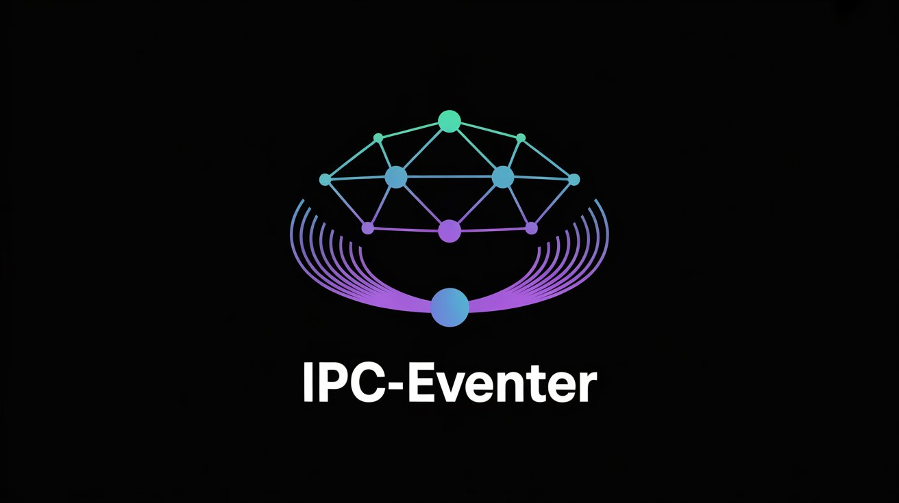

[](https://github.com/Ajayos/ipc-eventer)


---

[](https://www.npmjs.com/package/ipc-eventer)
[](LICENSE)
[](https://nodejs.org)

---

> **Secure, Encrypted, Event-Based Inter-Process Communication**
> For **Node.js** over **Named Pipes** (Windows) or **Unix Domain Sockets** (Linux/macOS).

`ipc-eventer` is a fast, event-based IPC system for Node.js with optional **AES-256-GCM end-to-end encryption** — perfect for:

* Background managers and workers
* Secure communication between local processes or devices

---

## ✨ Features

* 🔌 Simple EventEmitter-style API (`emit` / `on`)
* 🔒 Built-in AES-256-GCM encryption (password-protected)
* 🔄 Auto-reconnect support (configurable)
* 📢 Broadcast messages to all clients
* 🆔 Unique client IDs and customizable friendly names
* 🖥 Cross-platform: Windows, macOS, Linux
* 🚀 Zero dependencies — only Node.js core modules
* 📡 Uses native Named Pipes (Windows) or Unix Domain Sockets (macOS/Linux)

---

## 🚀 Overview

`ipc-eventer` enables secure and reliable communication **between Node.js processes on the same machine**. It is ideal for:

* Modular, multi-process apps
* Local service orchestration and messaging
* Secure client-server IPC without network exposure

Key features include **automatic reconnects**, **heartbeat monitoring**, and **message encryption** — all via a simple event-driven API.

---

## 📖 Details

* **Local IPC only:** Uses OS-native IPC (Named Pipes on Windows, Unix Domain Sockets on Linux/macOS).
* **Strong encryption:** AES-256-GCM with password-based key derivation.
* **EventEmitter-based:** Easy `.on()` and `.emit()` methods for messaging.
* **Heartbeat & auto-reconnect:** Detects dead connections and reconnects clients automatically.
* **Clean disconnect handling:** Server can force disconnect clients gracefully.
* **Lightweight:** Minimal dependencies, just Node.js core modules.

---

## 🔐 Security

* All messages are **encrypted with AES-256-GCM** before sending.
* Password-derived encryption keys use PBKDF2 with HMAC-SHA256 and 200,000 iterations.
* Protects against replay attacks and message tampering via authentication tags.
* Encrypted handshake ensures metadata and identification are protected.

> **Important:** Keep your shared password secret. Use environment variables or secure config stores.

---

## ⚙️ Architecture

* **Server** listens on a named pipe/socket and accepts multiple client connections.
* **Clients** connect with a unique ID and optional friendly name.
* Messages are newline-delimited JSON strings, encrypted transparently.
* Both server and clients emit and listen to events via their sockets.
* Heartbeat ping/pong detects stale connections.
* Clients auto-reconnect after disconnection/errors.

---

## 📌 Important Notes

* Works **only on the same machine** — no network/TCP support.
* Use **unique pipe names** to avoid conflicts.
* Only one active connection per client ID; reconnect closes previous socket.
* Always handle `"error"` events to prevent crashes.
* Client and server **passwords must match** for encryption.
* Server mediates all communication; no direct client-to-client broadcast.
* Cross-platform support for Windows, macOS, Linux.

---

## 🛠 Troubleshooting

| Problem                   | Possible Cause                      | Solution                                  |
| ------------------------- | ----------------------------------- | ----------------------------------------- |
| Client fails to connect   | Server not running or pipe busy     | Verify server status; change pipe name    |
| Encryption errors         | Password mismatch or corrupt data   | Check matching passwords                  |
| Unexpected disconnections | Heartbeat timeout or socket closed  | Ensure server running and reachable       |
| `EADDRINUSE` on server    | Pipe/socket already in use          | Stop conflicting processes or rename pipe |
| Invalid JSON received     | Data corruption or version mismatch | Send only ipc-eventer formatted messages  |

---

## 🔧 Best Practices

* Store encryption passwords securely (env vars, vaults).
* Handle disconnects and errors gracefully for reliability.
* Always listen for `"error"` events on server and clients.
* Use meaningful, unique pipe names.
* Send small-to-medium-sized JSON-serializable messages.
* Structure emitted events clearly.

---

## 📦 Installation

```bash
npm install ipc-eventer
```

---

## 🚀 Quick Start

### Server Example

```js
import { IPCServer } from "ipc-eventer";

const ipcServer = new IPCServer("aosx-test-pipe");

ipcServer.on("listening", (pipeName) => {
  console.log(`✅ Server listening on "${pipeName}"`);
});

ipcServer.on("connected", (socket) => {
  console.log(`📡 Client connected: ${socket.name} (${socket.id})`);

  // Welcome client
  socket.emit("message", `Welcome, ${socket.name}!`);

  // Broadcast join notice
  socket.broadcast("message", `👋 ${socket.name} joined!`);

  // Echo example
  socket.on("echo", (data) => {
    console.log(`🔄 Echo from ${socket.name}:`, data);
    socket.emit("echo", data);
  });
});

ipcServer.on("disconnected", (socket) => {
  console.log(`❌ Client disconnected: ${socket.name} (${socket.id})`);
});

ipcServer.start();
```

---

### Client Example

```js
import { IPCClient } from "ipc-eventer";

const ipcClient = new IPCClient("aosx-test-pipe", {
  name: "TestClient",
  reconnect: true,
  reconnectInterval: 3000,
});

ipcClient.on("connected", (socket) => {
  console.log(`🎉 Connected as ${socket.name} (${socket.id})`);

  socket.on("message", (msg) => {
    console.log("💬 Server says:", msg);
  });

  socket.emit("echo", "Hello from client!");
});

ipcClient.on("message", (msg) => {
  console.log("📢 Broadcast:", msg);
});

ipcClient.connect();
```

---

## 🔒 Encryption

To enable AES-256-GCM encryption, provide a shared password:

```js
new IPCServer("pipe-name", {
  password: "mySecret123",
});

new IPCClient("pipe-name", {
  password: "mySecret123",
});
```

* Password is converted into a strong encryption key using PBKDF2.
* Messages are encrypted transparently before sending.
* No password means plaintext communication.

---

## 📡 Broadcast Messages

From the server, broadcast to all clients easily:

```js
socket.broadcast("message", "Hello all clients!");
```

---

## 🔄 Auto Reconnect (Client)

Enable auto-reconnect in client options:

```js
const client = new IPCClient("pipe", {
  reconnect: true,
  reconnectInterval: 5000,
});
```

---

## ⚙️ API Reference

### Server

```ts
new IPCServer(pipeName: string, options?: {
  password?: string
})
```

* **Events:**

  * `listening(pipeName: string)`
  * `connected(socket)`
  * `disconnected(socket)`
  * `error(err: Error)`
  * `connect()`

* **Socket Methods:**

  * `socket.emit(event: string, data?: any)`
  * `socket.on(event: string, handler: Function)`
  * `socket.broadcast(event: string, data?: any)`
  * `socket.disconnect()`

---

### Client

```ts
new IPCClient(pipeName: string, options?: {
  name?: string,
  reconnect?: boolean,
  reconnectInterval?: number,
  password?: string
})
```

* **Events:**

  * `connected(socket)`
  * `disconnected(socket)`
  * `error(err: Error)`
  * `connect()`
  * `disconnect()`

* **Socket Methods:**

  * `socket.emit(event: string, data?: any)`
  * `socket.on(event: string, handler: Function)`

---

## 📜 License

MIT © [Ajay o s](https://github.com/Ajayos)

---

## 🙌 Contributions & Feedback

Contributions, issues, and feature requests are welcome!
Please open issues or pull requests on the [GitHub repository](https://github.com/Ajayos/ipc-eventer).

---

Thank you for using **ipc-eventer**!
Happy IPC’ing! 🚀

